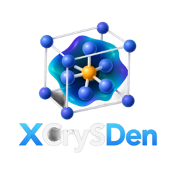

  

# XCrySDen

Flatpak packaging of [XCrySDen](http://www.xcrysden.org/), a molecular graphics program for the visualization of crystalline structures, molecular structures, electron densities, Fermi surfaces, and related computational chemistry and materials-science data.

## Upstream

**XCrySDen**
Author and upstream developer: **Anton Kokalj**

Website: http://www.xcrysden.org/

This repository contains the Flatpak packaging for XCrySDen 1.6.2 and is not the upstream XCrySDen source repository.

## Flatpak Maintainer

**Rakib Raihan Remon**

Rakib Raihan maintains the Flatpak packaging and integration of XCrySDen for the Flathub distribution.

## License

XCrySDen is distributed under the **GNU General Public License, version 2 or later (GPL-2.0-or-later)**.

The licensing terms of the upstream XCrySDen project and its bundled components remain applicable to their respective code and files.

## Application ID

`org.xcrysden.XCrySDen`

## Version

**1.6.2**

## Packaging Notes

This Flatpak packages the upstream XCrySDen Linux distribution together with the legacy Tcl/Tk and Togl components required by the application.

Additional Flatpak integration includes:

* Desktop application entry
* AppStream metadata
* Application icon
* Flatpak runtime integration
* Compatibility adjustments for running XCrySDen through XWayland

The packaging does not claim authorship of the XCrySDen software itself.

## Build Process
flatpak-builder --user --install build-dir org.xcrysden.XCrySDen.yml

